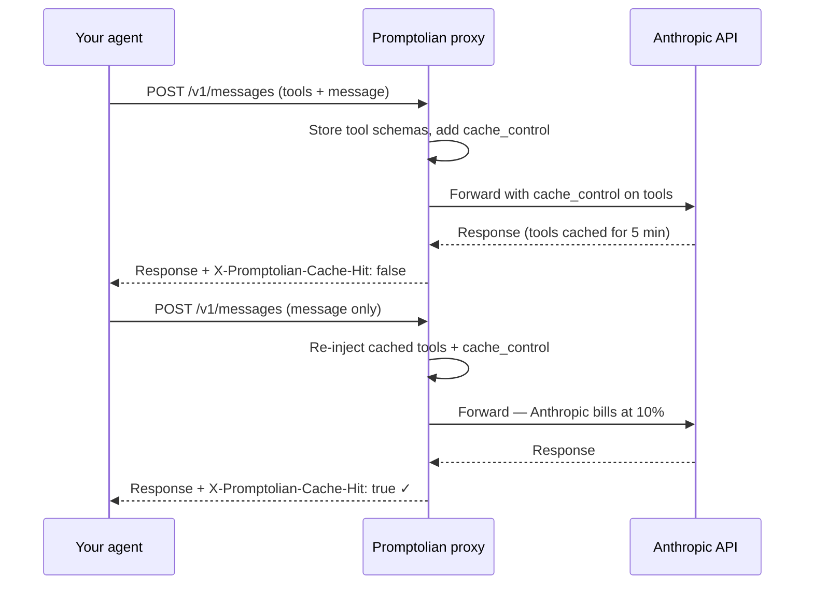
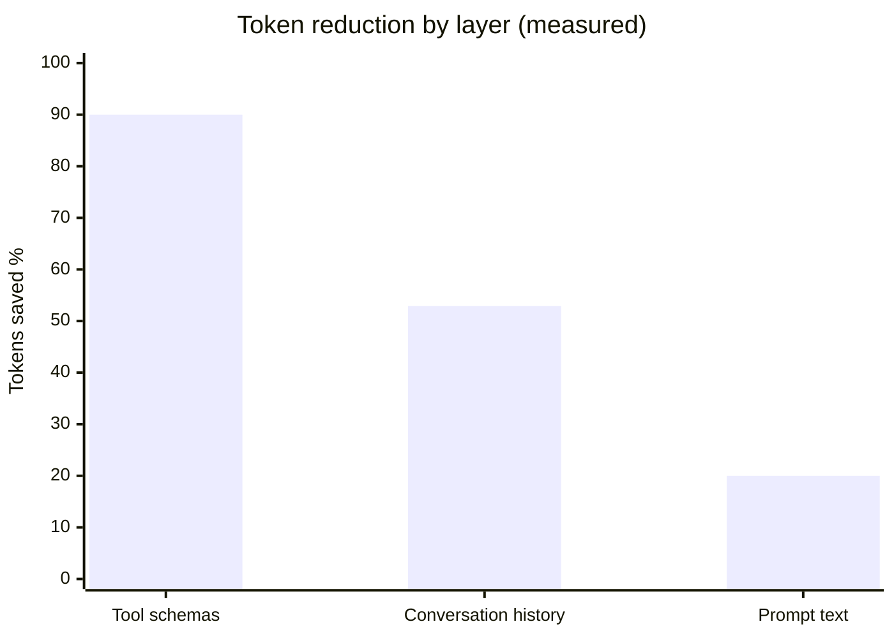
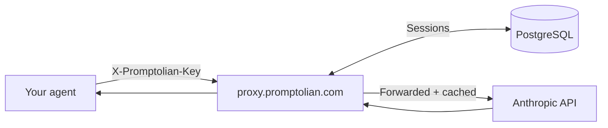

# Promptolian

> Transparent proxy for AI agents — caches tool schemas automatically so you stop paying for the same tokens on every call.

**[promptolian.com](https://promptolian.com)** · [Pricing](https://promptolian.com/pricing.html) · [Dashboard](https://promptolian.com/dashboard.html) · [Docs](https://promptolian.com/docs.html)

---

## The problem

Every time your agent calls the API, it re-sends the full tool schema — even if nothing changed. For 5 tools that's ~600 tokens on every single call.

```
Call 1:  [system] + [tools: 600 tok] + [message]   → full price
Call 2:  [system] + [tools: 600 tok] + [message]   → full price again
Call 3:  [system] + [tools: 600 tok] + [message]   → full price again
```

Promptolian fixes this with one line of code.

---

## How it works



On call 2 onwards, Anthropic charges 10% of the normal tool token price. You save ~90% on tool tokens across the session.

---

## Savings



| Layer | Savings | Mechanism |
|---|---|---|
| **Tool schemas** | **~90%** session avg | Proxy caches via Anthropic prompt cache — 10% billed on hit |
| **Conversation history** | **52.9%** | KV-cache sandwich — old turns summarised, first 2 + last 4 kept verbatim |
| **Prompt text** | **~20%** | Symbol rules, filler removal, grammar cleanup |

100% fact preservation across all layers — numbers, file paths, named entities unchanged.

---

## Cost impact

For an agent making **500 calls/day** with **5 tools**:

```
Tool tokens per call  : 5 × 120 = 600 tok
Monthly without proxy : 500 × 30 × 600 = 9,000,000 tok → $27.00
Monthly with proxy    : 9,000,000 × 10% = 900,000 tok  → $2.70
Monthly saving        : $24.30  (at Claude Sonnet 4 pricing, $3/1M tokens)
```

---

## Quickstart

### Option A — Transparent proxy (any language)

One line to start, one line to switch:

```bash
pip install "promptolian[proxy]"
promptolian proxy              # localhost:3002
```

```python
import anthropic

client = anthropic.Anthropic(
    base_url="http://localhost:3002",   # only change needed
)
```

The proxy handles caching automatically. Pass tools on call 1; omit them on call 2+, or pass them every time — the proxy does the right thing either way.

### Option B — Python SDK wrapper

```bash
pip install promptolian
```

```python
from promptolian import patch_anthropic
patch_anthropic()   # call once at startup — all clients patched globally

import anthropic
client = anthropic.Anthropic()  # unchanged — compression is transparent
```

### Option C — Claude Code MCP

```bash
pip install "promptolian[mcp]"
promptolian mcp install   # adds to ~/.claude/settings.json, then restart Claude Code
```

---

## Cloud proxy

Skip self-hosting entirely. Use `proxy.promptolian.com`:

```python
client = anthropic.Anthropic(
    base_url="https://proxy.promptolian.com",
    default_headers={"X-Promptolian-Key": "pk_..."},
)
```



| Plan | Price | API keys | Sessions |
|---|---|---|---|
| **Free** | $0 | — | SQLite · self-hosted |
| **Solo** | $9/mo | 1 | PostgreSQL · always-on |
| **Team** | $29/mo | Up to 10 | PostgreSQL · per-project breakdown |

→ [Sign up at promptolian.com/pricing.html](https://promptolian.com/pricing.html)

---

## Sensitive data detection

The proxy scans every message for credentials and data-dump patterns before forwarding. Events are stored per account and exposed only to the account holder — never aggregated.

| Category | Risk | Detects |
|---|---|---|
| `CONNECTION_STRING` | **HIGH** | `postgres://`, `mysql://`, `mongodb://`, `redis://` URIs with credentials |
| `API_KEY` | **HIGH** | OpenAI `sk-`, AWS `AKIA`, GitHub `ghp_`/`gho_`, Slack `xoxb-`, Google `AIza` |
| `PRIVATE_KEY` | **HIGH** | RSA / EC / OPENSSH private key PEM blocks |
| `JWT` | **HIGH** | Three-part `eyXXX.eyXXX.XXX` bearer tokens |
| `ENV_FILE` | **HIGH** | 3+ consecutive `KEY=value` lines (.env pastes) |
| `SQL_DUMP` | MEDIUM | 3+ consecutive `INSERT INTO` statements |
| `STACK_TRACE` | MEDIUM | Python `Traceback (most recent call last)` |
| `CSV_DATA` | MEDIUM | 3+ rows × 5+ columns of comma-separated data |
| `LARGE_JSON` | MEDIUM | Array of 10+ JSON objects |

When a pattern fires the response includes a diagnostic header:
```http
X-Promptolian-Sensitive: HIGH
```

Retrieve your account's event log:
```bash
curl https://proxy.promptolian.com/proxy/pii-events \
  -H "X-Promptolian-Key: pk_..."
```
```json
{
  "count": 2,
  "events": [
    {
      "session_id": "a3f9c1d2",
      "risk_level": "HIGH",
      "categories": ["CONNECTION_STRING"],
      "timestamp": 1748131200.0
    }
  ]
}
```

### What is and isn't stored (GDPR)

**Cloud proxy — `proxy.promptolian.com`**

| Data | Stored server-side? | Who can access? | Retention |
|---|---|---|---|
| Message content (prompts, chat history) | **No** — processed in RAM, discarded after forwarding | Nobody | 0 |
| LLM responses | **No** — forwarded only | Nobody | 0 |
| Your Anthropic / OpenAI API key | **No** — forwarded in-flight only, never written to disk | Nobody | 0 |
| Tool schemas | **Yes** — stored for session caching | You (account holder) | Session TTL (~5 min) |
| Detection event: category name(s) | **Yes** — when a pattern fires | You only via `/proxy/pii-events` | Until account deletion |
| Tokens saved counter | **Yes** | You | Subscription lifetime |
| Email address | **Yes** — via Stripe at signup | Promptolian (billing only) | Subscription duration |

> No message content ever touches server-side storage. Only the category name (e.g. `CONNECTION_STRING`) and risk level are stored — enough to know what to rotate, nothing that could reconstruct the original text.

**Self-hosted proxy — `promptolian proxy` (local / SQLite)**

| Data | Where it goes |
|---|---|
| Everything | Stays in your local SQLite file (`~/.promptolian/sessions.db`). Nothing is sent to Promptolian's servers. |

---

## Response headers

Every proxied response includes diagnostic headers:

```http
X-Promptolian-Cache-Hit: true
X-Promptolian-Tokens-Saved: 540
X-Promptolian-Session: a3f9c1d2
X-Promptolian-Note: Tools re-injected from session cache. ~540 tokens billed at 10%.
X-Promptolian-Sensitive: HIGH
```

---

## Self-hosting

```bash
pip install -r requirements-selfhost.txt
python api/api.py          # REST API on :3001
# or
promptolian proxy          # transparent proxy on :3002
```

| Env var | Required | Description |
|---|---|---|
| `DATABASE_URL` | No | PostgreSQL URL — defaults to SQLite |
| `PROMPTOLIAN_MASTER_KEY` | Cloud only | Activates API key auth |
| `STRIPE_SECRET_KEY` | Cloud only | Billing |
| `SMTP_HOST` / `SMTP_USER` / `SMTP_PASS` | Cloud only | API key delivery emails |

---

## Benchmarks

Measured on 200 prompts across 5 domains (finance, legal, medical, code, devops):

| Metric | Value |
|---|---|
| Tool schema savings (session avg) | ~90% |
| Context history savings | 52.9% |
| Prompt text savings (median) | ~20% |
| Fact preservation rate | 100% (41 runs) |
| Proxy overhead | < 10ms |

Full methodology: [promptolian.com/benchmarks.html](https://promptolian.com/benchmarks.html)

---

## Repo structure

```
promptolian/        pip package — proxy, SDK wrappers, CLI, MCP server
public/             this submodule — website, API server, browser extension
tests/              pytest suite (48 tests)
services/           production Flask server + dashboard
tools/
  hooks/            Claude Code compression hooks
  scripts/          benchmark, post_article, build scripts
  dev/              local dev utilities
  reports/          roadmap, schemas, onboarding docs
```