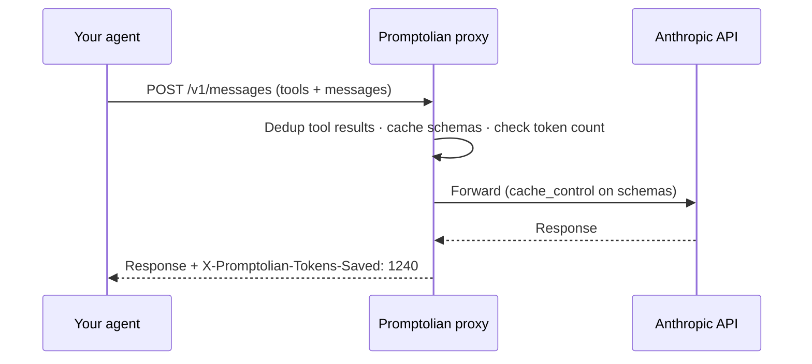

# Promptolian

**AI agents burn tokens repeating themselves. Promptolian stops that, transparently, with one line of code.**

A local proxy that sits between your code and the Anthropic / OpenAI API. No SDK changes. No new abstractions.

**[promptolian.com](https://promptolian.com)** · [Developer Guide](GUIDE.md) · [Pricing](https://promptolian.com/pricing.html) · [Docs](https://promptolian.com/docs.html) · [Benchmarks](https://promptolian.com/benchmarks.html)

---

## Three problems, one proxy

**Problem 1 — Tool outputs repeat across turns.**
Agentic workflows read the same files, run the same bash commands, get the same API responses, turn after turn. Each repeat costs full tokens.

**Problem 2 — Tool schemas re-sent on every call.**
Every API call re-sends the full tool schema JSON even if nothing changed. 5 tools ≈ 600 tokens wasted per call, silently, forever.

**Problem 3 — Context window fills up and quality collapses.**
Built-in compression (Anthropic, OpenAI) removes 98–99% of context tokens. Specific facts — config values, file paths, exact numbers — disappear. The agent hallucinates or asks you to repeat yourself.

Promptolian fixes all three. The first two are free. The third requires an API key.

---

## How it works


```mermaid
sequenceDiagram
    participant A as Your agent
    participant P as Promptolian proxy
    participant C as Anthropic API

    A->>P: POST /v1/messages (tools + messages)
    P->>P: Dedup tool results · cache schemas · check token count
    P->>C: Forward (cache_control on schemas)
    C-->>P: Response
    P-->>A: Response + X-Promptolian-Tokens-Saved: 1240
```

---

## Savings

| Feature | Savings | Free? |
|---|---|---|
| Tool result dedup (REF + DIFF) | **34.6%** on tool output tokens · 99% fact retention | Yes |
| Tool schema caching | **~90%** session average | Yes |
| KV-sandwich context compression | **4.26/5** quality score · 22% tokens removed | Paid (API key) |
| Session reset | Never hit the context wall | Paid (API key) |

Context quality benchmark (25 sessions, Factory.ai 6-dimension scoring):

| | Promptolian | Anthropic built-in | OpenAI built-in |
|---|---|---|---|
| Quality score | **4.26 / 5** | 3.44 / 5 | 3.35 / 5 |
| Tokens kept | 78.2% | 1.3% | 0.7% |

Tool compression benchmark (9 synthetic agentic sessions, 49 tool results):

| | Result |
|---|---|
| Token savings on tool outputs | 34.6% |
| Fact retention after compression | 99.0% |
| REF compressions (exact dedup) | 12 |
| DIFF compressions (similar content) | 6 |

---

## Cost impact — tool schema caching

For an agent making **500 calls/day** with **5 tools**:

```
Tool tokens per call  : 5 × 120 = 600 tok
Monthly without proxy : 500 × 30 × 600 = 9,000,000 tok → $27.00
Monthly with proxy    : 9,000,000 × 10% = 900,000 tok  → $2.70
Monthly saving        : $24.30  (Claude Sonnet 4 pricing, $3/1M tokens)
```

---

## Quickstart

### Option A — Transparent proxy (any language)

```bash
pip install "promptolian[proxy]"
python -m promptolian.proxy                                     # localhost:3002
PROMPTOLIAN_API_KEY=your_key python -m promptolian.proxy --reset-at 0.70  # + KV-sandwich
```

```python
import anthropic

# Only change needed
client = anthropic.Anthropic(base_url="http://localhost:3002")
```

Tool result dedup and schema caching are automatic with no key. Session reset + KV-sandwich require `PROMPTOLIAN_API_KEY`.

### Option B — Python SDK wrapper

```bash
pip install promptolian
```

```python
from promptolian import patch_anthropic
patch_anthropic()   # call once at startup — all clients patched globally

import anthropic
client = anthropic.Anthropic()  # unchanged
```

### Option C — Claude Code MCP

```bash
pip install "promptolian[mcp]"
```

Add to `~/.claude/settings.json`:
```json
{
  "mcpServers": {
    "promptolian": {
      "command": "promptolian-mcp"
    }
  }
}
```

Restart Claude Code. Adds `compress_prompt`, `compress_tools_schema`, `compression_stats` tools.

---

## Cloud proxy

Skip self-hosting. Use `proxy.promptolian.com`:

```python
client = anthropic.Anthropic(
    base_url="https://proxy.promptolian.com",
    default_headers={"X-Promptolian-Key": "pk_..."},
)
```

| Plan | Price | API keys | Sessions | KV-sandwich |
|---|---|---|---|---|
| **Free** | $0 | — | SQLite · self-hosted | — |
| **Solo** | $9/mo | 1 | PostgreSQL · always-on | Yes |
| **Team** | $49/mo | Up to 10 | PostgreSQL · per-project | Yes |

→ [promptolian.com/pricing.html](https://promptolian.com/pricing.html)

---

## Tool result compression

In agentic workflows, the same files get read repeatedly, bash outputs recur, search results repeat. The proxy deduplicates automatically before forwarding to the provider:

- **Exact repeat** → `[TOOL_CACHE_REF: same as call #N]` — ~5 tokens instead of thousands
- **Similar content** → compact diff showing only changed lines

Works for both Anthropic (`type=tool_result`) and OpenAI (`role=tool`) formats. No configuration needed — fires automatically on every request.

Run the benchmark yourself:
```bash
python3 tools/scripts/benchmark_tool_compression.py
python3 tools/scripts/benchmark_tool_compression.py --verbose
```

---

## Session reset

The proxy tracks cumulative token usage per session. When usage approaches the model's context window limit, it compresses history and starts a fresh session — injecting the compressed context as a system prompt.

```bash
PROMPTOLIAN_API_KEY=your_key python -m promptolian.proxy --reset-at 0.70
```

Startup shows which compression mode is active:
```
Session reset : at 70% · compression: cloud (https://api.promptolian.com)
```

Compression priority: local `context_engine` → cloud API (`PROMPTOLIAN_API_KEY`) → skip reset.

Response header on reset: `X-Promptolian-Reset: true`

---

## Sensitive data detection

The proxy scans messages for credentials before forwarding. Events are stored per account and exposed only to the account holder.

| Category | Risk | Detects |
|---|---|---|
| `CONNECTION_STRING` | **HIGH** | postgres://, mysql://, mongodb://, redis:// URIs with credentials |
| `API_KEY` | **HIGH** | OpenAI sk-, AWS AKIA, GitHub ghp_/gho_, Slack xoxb-, Google AIza |
| `PRIVATE_KEY` | **HIGH** | RSA / EC / OPENSSH private key PEM blocks |
| `JWT` | **HIGH** | Three-part eyXXX.eyXXX.XXX bearer tokens |
| `ENV_FILE` | **HIGH** | 3+ consecutive KEY=value lines |
| `SQL_DUMP` | MEDIUM | 3+ consecutive INSERT INTO statements |
| `STACK_TRACE` | MEDIUM | Python Traceback blocks |

Response header when pattern fires: `X-Promptolian-Sensitive: HIGH`

---

## Response headers

```http
X-Promptolian-Session: a3f9c1d2
X-Promptolian-Tokens-Saved: 540
X-Promptolian-Tool-Tokens-Saved: 320
X-Promptolian-Cache-Hit: true
X-Promptolian-Reset: true
X-Promptolian-Sensitive: HIGH
```

---

## Self-hosting

```bash
pip install -r requirements-selfhost.txt
python api/api.py          # REST API on :3001
python -m promptolian.proxy  # transparent proxy on :3002
```

| Env var | Required | Description |
|---|---|---|
| `PROMPTOLIAN_API_KEY` | No | Key for cloud KV-sandwich compression on session reset |
| `DATABASE_URL` | No | PostgreSQL URL — defaults to SQLite |
| `PROMPTOLIAN_MASTER_KEY` | Cloud only | Activates API key auth |
| `STRIPE_SECRET_KEY` | Cloud only | Billing |
| `SMTP_HOST` / `SMTP_USER` / `SMTP_PASS` | Cloud only | API key delivery emails |

---

## Benchmarks

| Metric | Value |
|---|---|
| Tool result token savings | **34.6%** (9 sessions, 49 tool results) |
| Tool result fact retention | **99.0%** |
| Tool schema savings | **~90%** session average |
| Context quality score | **4.26 / 5** (vs Anthropic 3.44, OpenAI 3.35) |
| Context compression | 22% tokens removed |
| Proxy overhead | < 10ms |

Context quality measured across 25 sessions, 5 task domains, Factory.ai 6-dimension probe scoring. Full methodology: [promptolian.com/benchmarks.html](https://promptolian.com/benchmarks.html)

---

## Further reading

- **Article**: [Everyone compresses their agent's context. Nobody measures what it forgets.](https://dev.to/mauriziol/everyone-compresses-their-agents-context-nobody-measures-what-it-forgets-5gp3) — Dev.to
- **Interactive cost chart**: [promptolian.com/ucurve.html](https://promptolian.com/ucurve.html)
- **Full benchmarks**: [promptolian.com/benchmarks.html](https://promptolian.com/benchmarks.html)

---

## Repo structure

```
website/
  index.html          landing page
  pricing.html        plans + ROI calculator
  benchmarks.html     context quality benchmark results
  ucurve.html         interactive cost/quality chart
  docs.html           integration docs

api/
  api.py              Flask REST API (port 3001)
  context_engine.py   KV-sandwich context compression pipeline

promptolian/          pip package (github.com/Maurizio-L/promptolian)
  proxy.py            transparent proxy (port 3002)
  compress.py         rule-based compression (no deps)
  mcp_server.py       Claude Code MCP server

tools/scripts/
  gen_agentic_sessions.py       synthetic agentic session generator
  benchmark_tool_compression.py tool compression benchmark runner

extension/            browser extension (Chrome + Firefox)
docs/                 OpenAPI spec
media/                brand assets
```
